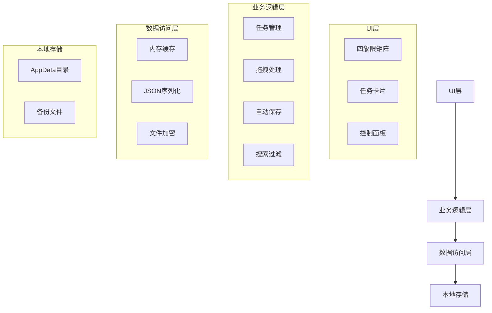

### 1. 系统架构


### 2. 核心模块设计
#### 2.1 任务管理模块
- 类结构图：
```plantuml
class TaskItem {
    +Guid Id
    +string Title
    +QuadrantType Quadrant
    +DateTime CreateTime
    +bool IsCompleted
    +DateTime? CompleteTime
}

enum QuadrantType {
    Q1
    Q2
    Q3
    Q4
}

class TaskManager {
    +ObservableCollection<Q1Tasks>
    +ObservableCollection<Q2Tasks>
    +ObservableCollection<Q3Tasks>
    +ObservableCollection<Q4Tasks>
    +AddTask()
    +RemoveTask()
    +MoveTask()
    +SearchTasks()
}
```

#### 2.2 持久化模块
- 数据流图：
```
用户操作 --> 内存变更检测 --> 防抖动处理 --> JSON序列化 --> 加密存储
                                                      ↓
定时保存事件 --------------------------------------------+
```

### 3. 数据设计
#### 3.1 存储结构
```json
{
  "version": "1.0",
  "tasks": [
    {
      "id": "3fa85f64-5717-4562-b3fc-2c963f66afa6",
      "title": "完成季度报告",
      "quadrant": "Q1",
      "createdTime": "2024-03-20T09:00:00Z",
      "isCompleted": false,
      "tags": ["工作", "紧急"]
    }
  ],
  "config": {
    "autoCleanDays": 30,
    "lastBackupTime": "2024-03-20T12:00:00Z"
  }
}
```

#### 3.2 文件管理策略
```
AppData/Roaming/QuadrantManager/
├── data
│   ├── main.json       # 主数据文件
│   └── backup/         # 自动备份目录
│       ├── 20240320_1200.bak
│       └── 20240321_0900.bak
└── logs
    └── error.log       # 异常日志
```

### 4. 接口设计
#### 4.1 公共API列表
| 接口名称          | 参数                          | 返回值  | 说明                 |
|-------------------|-------------------------------|---------|----------------------|
| AddTask           | string title, QuadrantType    | void    | 添加新任务           |
| MoveTask          | Guid taskId, QuadrantType     | bool    | 移动任务位置         |
| DeleteTask        | Guid taskId                   | bool    | 删除指定任务         |
| GetQuadrantTasks  | QuadrantType                  | Task[]  | 获取指定象限所有任务 |
| SearchTasks       | string keyword                | Task[]  | 全局搜索任务         |

#### 4.2 序列化接口示例
```csharp
public interface IDataService
{
    Task SaveDataAsync(TaskData data);
    Task<TaskData> LoadDataAsync();
    
    event EventHandler<DataChangedEventArgs> DataChanged;
}

public class DataChangedEventArgs : EventArgs
{
    public ChangeType ChangeType { get; set; }
    public Guid[] AffectedTaskIds { get; set; }
}
```

### 5. 异常处理设计
#### 5.1 错误代码表
| 错误码 | 类型           | 处理方案                         |
|--------|----------------|----------------------------------|
| 1001   | 文件读写失败   | 尝试使用备份恢复，记录错误日志   |
| 1002   | 数据校验失败   | 丢弃异常数据，弹出警告提示       |
| 1003   | 内存溢出       | 触发自动清理机制，释放缓存       |
| 1004   | 拖拽操作冲突   | 自动回滚操作，显示错误动画       |

### 6. 部署方案
#### 6.1 安装包结构
```
QuadrantManager_1.0.0.msi
├── CoreDLLs
│   ├── Newtonsoft.Json.dll
│   └── DragDropLib.dll
├── Locales
│   ├── zh-CN.resx
│   └── en-US.resx
└── Resources
    ├── default_theme.xaml
    └── icons/
```